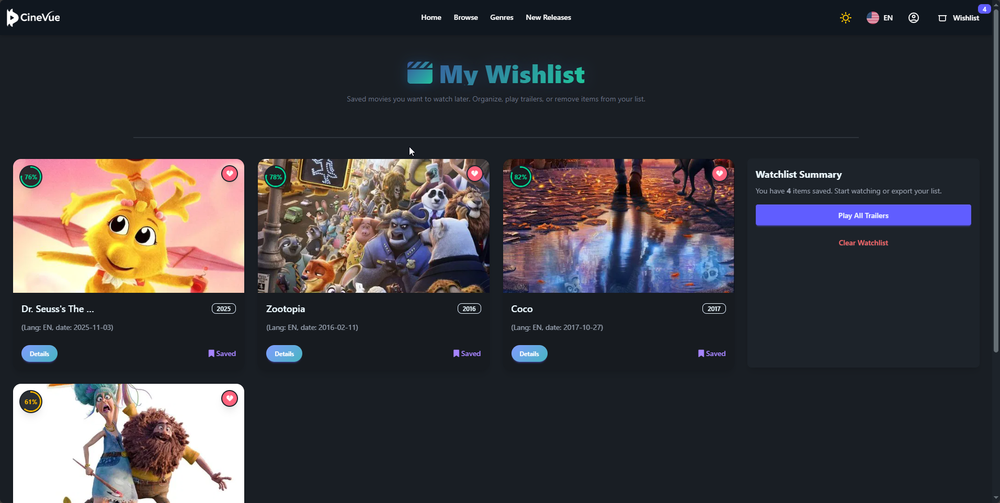

# CineVue MovieApp 🎬


> CineVue MovieApp is an advanced Angular project developed by a team of 5.  
> It integrates with TMDB API to display the latest movies, supports multiple languages, Dark/Light Mode, and includes professional-grade features.

---

## 🌐 Live Demo
[https://amralmohamdy.github.io/Movie-App/](https://amralmohamdy.github.io/Movie-App/)

> النسخة الحية للتجربة مباشرة على GitHub Pages.

---

## 📖 Project Overview

CineVue MovieApp is an Angular V+20 project developed as part of a course.  
It provides users with multiple pages and features:

- **Now Playing Movies**: Browse the latest movies  
- **Movie Details**: View detailed info and recommendations  
- **Search Movies**: Search and view results  
- **Genres Page**: Browse movies by genres  
- **Wishlist Page**: Add/remove movies to favorites  
- **Login/Register**: User authentication via Firebase  
- **Languages**: English, Arabic, French (ngx-translate + httptranslate)  
- **Dark/Light Mode**: Fully responsive UI with DaisyUI & Tailwind  
- **Lazy Loading** + Skeleton Loading for better performance  
- **Signals & Resource API** for efficient data management

> هذا المشروع يعرض أحدث الأفلام مع إمكانية إضافة المفضلة ودعم لغات متعددة ووضع الإضاءة الداكنة والفاتح.

---

## ⚙️ Technologies Used

- **Angular 20**  
- **DaisyUI** + **TailwindCSS**  
- **Firebase** (Auth & Firestore)  
- **TMDB API**  
- **ngx-translate** + **httptranslate** (multi-language support)  
- **Lazy Loading** + Skeleton Loading  
- **Signals & Resource API**  
- **Responsive Design**  

> التقنيات المستخدمة في المشروع تشمل Angular، Firebase، دعم تعدد اللغات، وواجهة مستجيبة لجميع الأجهزة.

---

## 🖥️ Pages & Features

1. **Movies List Page**: Home page showing latest movies  
2. **Movie Details Page**: Details, recommendations, and trailer via YouTube  
3. **Wishlist Page**: Shows user favorites with add/remove functionality  
4. **Search Results Page**: Display movie search results  
5. **Login / Register / Account Details**  
6. **Genre Filtering & Sorting**: Filter by genre, rating, popularity, or release date  
7. **Dark Mode Toggle** + Dynamic Page Title + Back to Top Button  
8. **Lazy Loaded Routes** for optimized performance  
9. **Multi-Language Support**: `en`, `ar`, `fr`  
10. **Notifications (Snackbar)** for interactive user feedback

> كل صفحة مصممة بعناية لتوفر تجربة سلسة مع التفاعل الكامل للمستخدم.

---

## 👥 Team Members

| Name | GitHub | Role |
|------|--------|------|
| Amr Mohamed | [@amralmohamdy](https://github.com/amralmohamdy) | Frontend / Full Stack |
| Mahmoud Mostafa | [@jodx19](https://github.com/jodx19) | Frontend / Components |
| Mina Hany | [@Mina-Hany](https://github.com/Mina-Hany) | UI / UX & Styling |
| Ahmed Mohsen | [@ahmedkader99](https://github.com/ahmedkader99) | Firebase Integration |
| Sayed Shabaan | [@Sayed023](https://github.com/Sayed023) | API Services / Features |

> الفريق عمل بشكل جماعي على كل الصفحات والميزات لضمان جودة المشروع.

---

## 🚀 Local Setup

To run the project locally:

```bash
# Install dependencies
npm install

# Run the project on localhost
ng serve
```

> Firebase settings are private and not required for local testing.

---

## 🖼️ Screenshots (Placeholders)

> You can replace these placeholders with real screenshots later:




> يمكنك لاحقًا إضافة لقطات الشاشة الحقيقية.

---

## 📄 Documentation & References

* [TMDB API Documentation](https://developer.themoviedb.org)
* [Angular Documentation](https://angular.io/docs)
* [DaisyUI Documentation](https://daisyui.com)

> جميع المصادر المستخدمة موثقة هنا للرجوع إليها.

---

## 📝 Future Improvements

* TMDB Account login for real Favorites and Watchlist
* Performance optimizations for heavy pages
* Support for additional languages and fully dynamic RTL layout
* Enhanced UI/UX with interactive trailers

> خطط مستقبلية لتطوير المشروع بشكل أفضل واحترافي أكثر.

---

## ⚖️ License

MIT License © 2025 CineVue MovieApp Team

```
